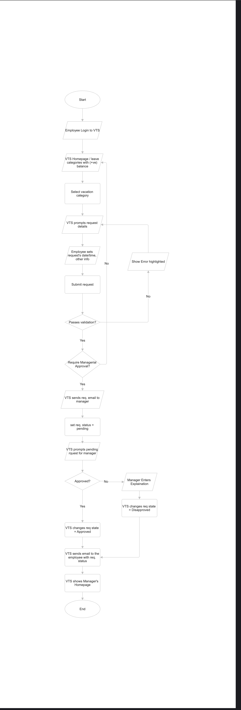
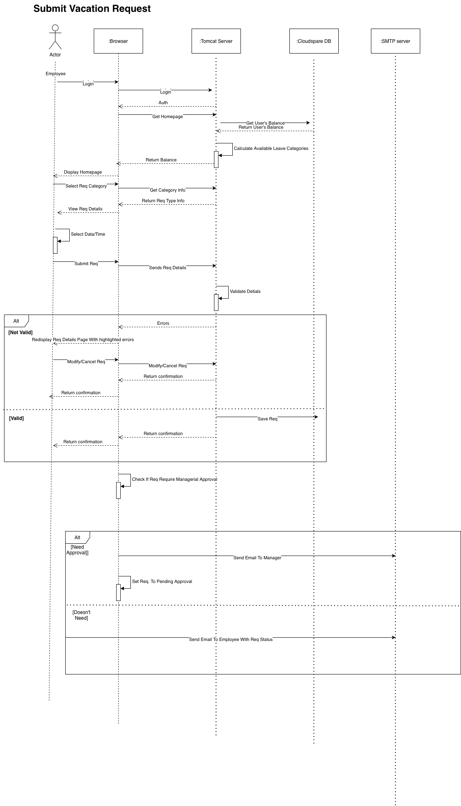
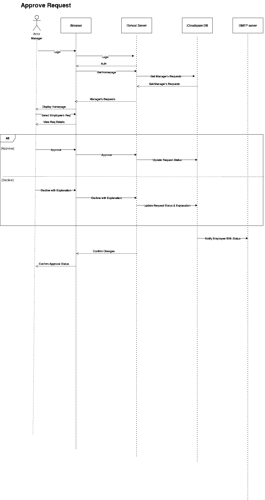
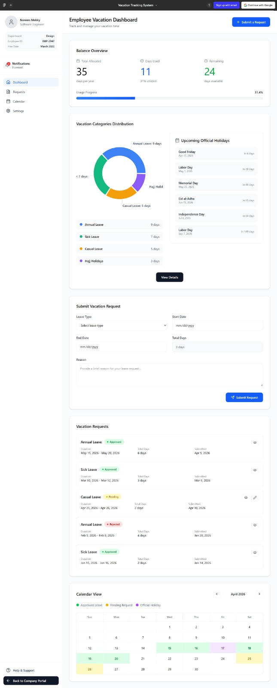
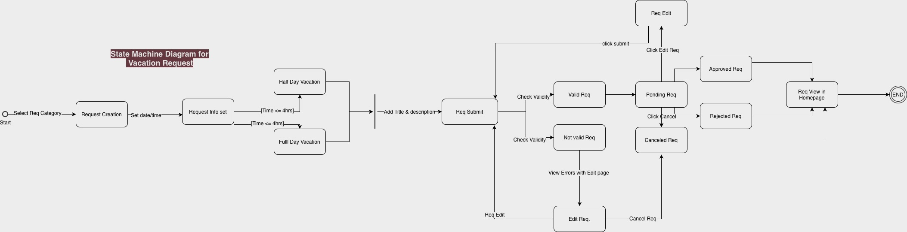
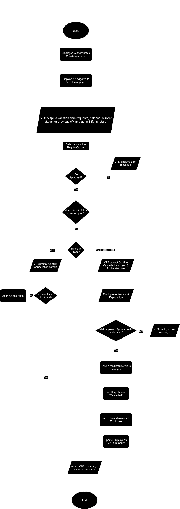
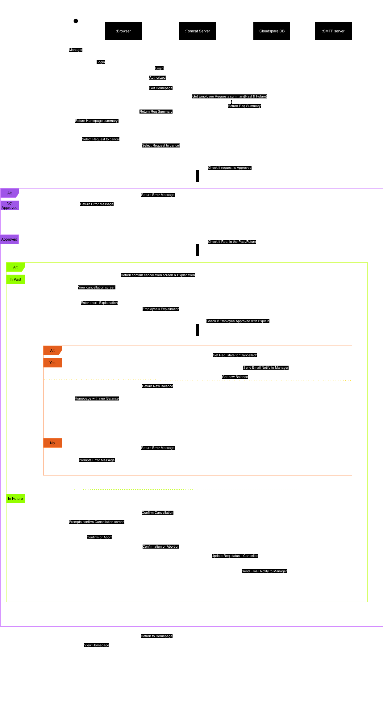
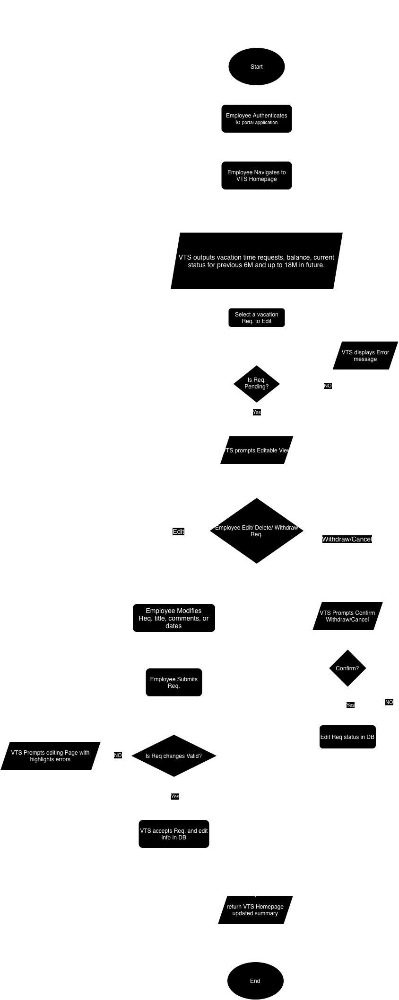
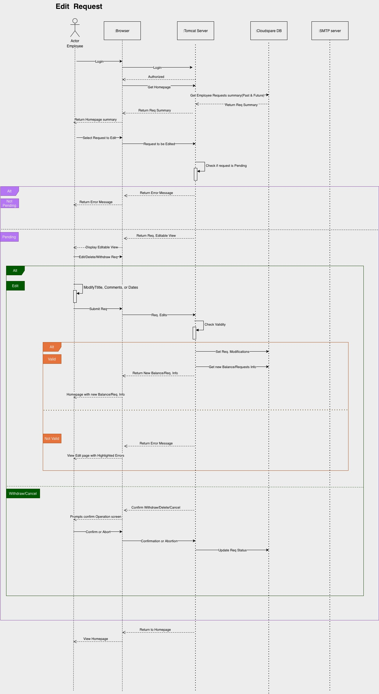
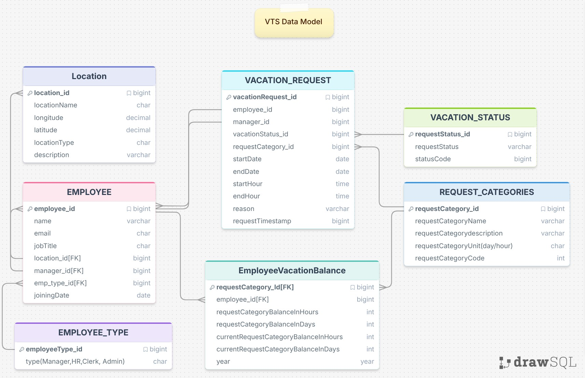

# Vacation Tracking System (VTS)

## Vision

A Vacation Tracking System (VTS) will provide individual employees with the capability to manage their own vacation time, sick leave, and personal time off, without having to be an expert in company policy or the local facility's leave policies.

## Goal

To give individual employees the capability and responsibility to manage their vacations.

## Motivations

- The need to streamline the functions of the human resources (HR) department.
- To minimize noncore, business-related activities of management.
- To give a sense of empowerment to the employees.

## Objective

System should be easy to use, intuitive, and intelligent.

---

## Functional Requirements

1. Implements rules-based system for leave time requests.
2. Enables manager approval (optional).
3. Provides access to requests for the previous calendar year, and allows requests to be made up to a year and a half in the future.
4. Uses e-mail notification to request manager approval and notify employees of request status changes.
5. Is implemented as an extension to the existing intranet portal system, and uses the portal's single-sign-on mechanisms for all authentication.
6. Keeps activity logs for all transactions.
7. Enables the HR and system administration personnel to override all actions restricted by rules, with logging of those overrides.
8. Allows managers to directly award personal leave time (with system-set limits).
9. Provides a Web service interface for other internal systems to query any given employee's vacation request summary.
10. Interfaces with the HR department legacy systems to retrieve required employee information and changes.
11. The process should require at most one manual approval by manager.

---

## Non-Functional Requirements

1. Improve internal business process of the organisation.
2. Easy to use, intuitive, and intelligent.
3. System must be easy to use.
4. Minimize time it takes to request and manage vacations to speed up the process.
5. The rules-based system should allow flexibility, validation and verification.
6. System should be scalable to allow viewing past requests and allow creating requests for a year ahead.
7. System should allow integrity with legacy system and other internal systems.
8. Able to keep history.

---

## Constraints

1. Uses existing hardware and middleware.
2. System should use the portal's single-sign-on mechanisms for all authentication.

---

## Diagrams

### Flow Chart



### Submit Request



### Approve Request



---

## Pseudo Code

### Submit Vacation Request

```
Employee.Login(Credentials)
    IF (Login==failed)
        Auth.show(error)
    Else
        Auth.show(Homepage) 

Employee.getAvailableLeaveBalancecategories()

Request.date()
Request.Time()
Employee.submits(Request)

Request.validate()
    IF (Request==NOT valid)
        Form.show(errors)
        Employee.modify(Request)
        OR Employee.cancel(Request)

    IF (Request==valid)
        DB.save(Request)
        IF (Request.requiresApproval==true)
            SMTP.sendEmail(Manager)
            Request.setStatus("Pending Approval")
        ELSE
            SMTP.sendEmail(Employee, Request.status)
```

---

### Approve Request

```
Manager.Login(Credentials)
    IF (Login==failed)
        Auth.show(error)
    ELSE
        Auth.show(Homepage)

Manager.getEmployeeRequests()

Manager.selects(Request)
Manager.view(Request.details)

IF (Manager.decision==Approve)
    DB.updateStatus(Request, "Approved")

IF (Manager.decision==Decline)
    Manager.provide(explanation)
    DB.updateStatus(Request, "Declined", explanation)

SMTP.sendEmail(Employee, Request.status)
Browser.show(Manager, "Confirmation")
```

---

## Week 2

### UI/UX

VTS system UI will follow the same color palette and design of the main Portal so that the user UI/UX is smooth.
Here is an assumption for the UI of the VTS.

#### Employee Homepage



[View Full UI PDF](UI/screencapture-figma-make-QlsBbvQvZDw3JxFLjZtbVt-Vacation-Tracking-System-2026-04-11-19_55_45.pdf)

---

### Q) What if we need to have in the future another status like HR_Pending, HR_Approval with minimum change?

It's Possible to add HR_Pending, HR_Approval status by:

1. Letting HR_Clerk/Admin add these statuses in the REQUEST_STATUS table
2. Add validation role to the validations system / Roles system
3. Let the UI views be separated into micro views so we can just add the same Employee requests Approval view to the Managers and all to HR VTS Homepage
4. Notification emails are based on the person who's approving the request whether its the HR or Manager (No need to change)

#### Pseudo Code for HR Approval (After request is being submitted by an Employee)

### HR Approve Request

```
Request.setEmployeeRequestStatus = "Pending HR"

HREmployee.Login

showHREmployeeHomePage.showRequestsApproval()
HREmployee.getRequestsForApproval()
HREmployee.selects(Request)
HREmployee.view(Request.details)

IF (HREmployee.decision==ApprovedByHR)
    DB.updateStatus(Request, "ApprovedByHR")
    Request.sendRequestForManagerApproval(managerId, RequestDetails[])

IF (HREmployee.decision==DeclinedByHR)
    DB.updateStatus(Request, "DeclinedByHR")

SMTP.sendEmail(Employee, Request.status)
```

---

### State Machine Diagram



---

### Cancel Request Use Case

#### Cancel Request Flow Chart



#### Cancel Request Sequence



---

### Edit Request Use Case

#### Edit Request Flow Chart



#### Edit Request Sequence



---

### VTS Data Model


